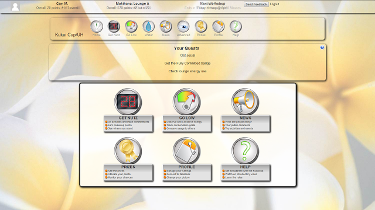
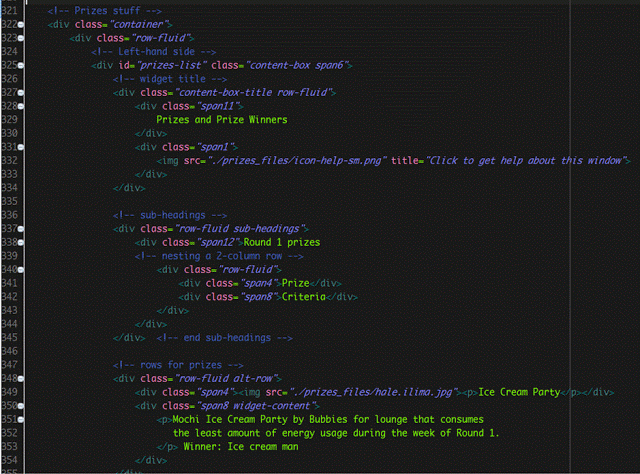
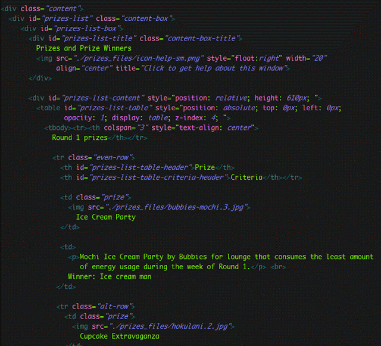
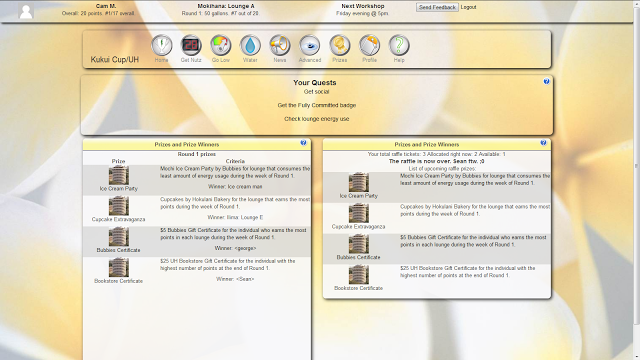
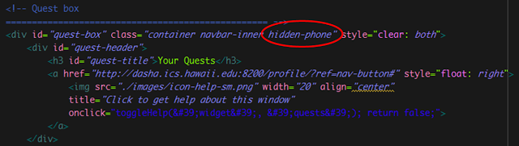
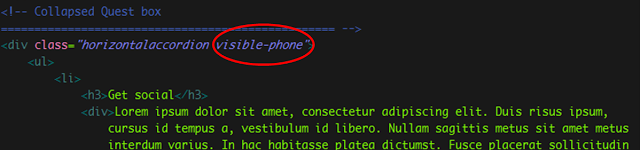
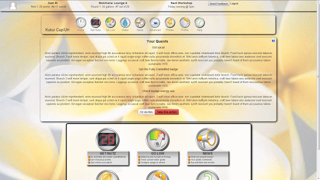
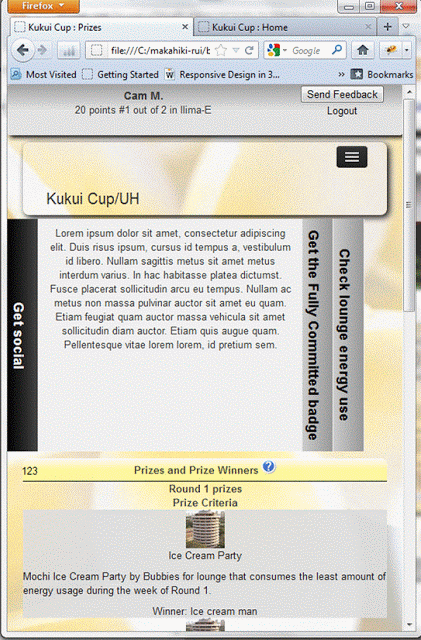

Ah the life of a programming project-- whether it's a website, a software program, or an internal computer system, they are all born out of a few hands, and nurtured throughout their life. Some unfortunately don't make it through many years while others go on with the longevity of a Redwoood tree. It seems like just yesterday that I picked up my current project-- the Kukui Cup website, already a young adolescent at this point-- and helped it grow into a mature young adult. I have many proud moments to remember when it made some giant leaps forward, as well as heartbreaking moments when it was rebellious and refused to listen to me. But nonetheless, I am extremely proud of the progress that was made, and I am certain that in the near future, the Kukui Cup will make even more phenomenal advances forward and become something that contributes very positively towards society. As my time with this project comes to a close, I would like to just share a few words about its latest progress and my hopes for its future.

The latest advancements in my version of the Kukui Cup interface are the Home and Prizes pages. The Home page retains the basic look and feel of the original, with no major changes to the layout. I tried to keep the look very simple yet elegant:

__Home:__

As for the Prizes page, I kept the same two-column layout that was originally there, but this time, I completely overhauled the HTML code, at least as far as those widgets went.

Notice the nice use of Twitter Bootstrap's fluid rows and spans? 
This is in contrast to the "old" way of doing things with tables (yuck!), which was how it originally was:

What's with all those id's, man? Totally unnecessary.. --oh, and extra yuck! There's even "style" attributes in there! I totally blocked them out of my mind upon getting rid of them. Everyone knows that styling should be done with CSS! 
Here's the final output of the Prizes page. There's still a lot that could be cleaned up and fixed, but I think it's generally likeable.

__Prizes:__

Finally, one thing that I finally got working was the responsiveness (cue the fanfare and fireworks). In the beginning, I was trying to implement Twitter Bootstrap's [responsiveness](http://getbootstrap.com/) through the supported classes, but to no avail. But one night earlier in this week, I took a final stab at getting those darned things to work, and it did! --hurray for 2:00 AM epiphanies.. 
Frustratingly enough, the solution is actually very simple:

1. Get the [responsive-utilities.less](https://github.com/twbs/bootstrap/blob/a7b8e52f8e08cc821d7324153885c085fad25c1a/less/responsive-utilities.less) file from the Twitter Bootstrap GitHub repository.
2. Reference it in your HTML page like so: `<link rel="stylesheet/less" type="text/css" href="./css/responsive-utilities.less">` (I saved mine in a folder named "css"). *note: it must be done in this format! Otherwise it will not work.

And that's it! Now all you have to do is pick a component that you want to make responsive, and add one of the support classes to it. I wanted the Quest Bar to disappear when it got to a small size and be replaced by a smaller one, so I added the class "hidden-phone" to make it magically disappear:

 ...and likewise I added "visible-phone" to the collapsed version, so that it magically appears when the browser is much smaller.
 

To see it in action:

Pretty darn cool, if you ask me.

Certainly this project is far from being complete; there are still design issues to resolve, bugs to weed out, and many more things to figure out. But considering where this site was just a few months ago and where it is now, I know my team and I have made enormous leaps forward and have taken this project to a whole new level. I hope that it can continue to be nurtured and improved, for I know that it is definitely on its way to being something spectacular.
